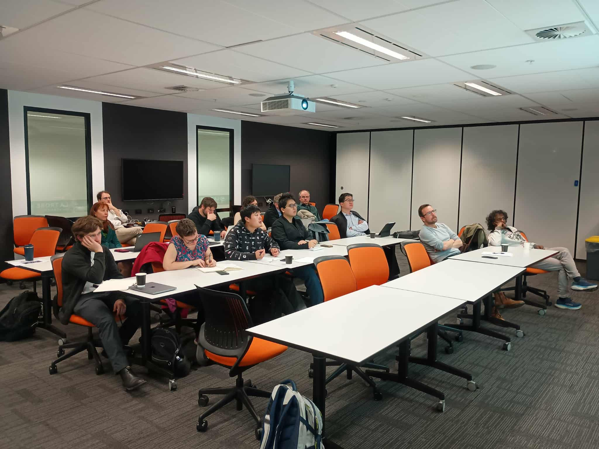

The inaugural meeting and seminar of the Victorian GAP took place 19th September 2025.

<!--more-->

Thank you for the many of you that attended the first Victorian GAP meeting!

In future, we hope to have about 2 meetings each year, one for each semester/term so that we can maximise attendance.

Those in Victoria working on topics related to geometry, analysis and PDE and would like to become members and to be included in: https://vicgap.org/members/, please [email](mailto:geometry.analysis.pde@gmail.com) us with the following: 

  -  editing out the [MYNAME.md](/uploads/MYNAME.md) file attached in the fields
  - a headshot image of about 400x400 pixels (optional, although highly recommended!).

--Here are some images from the day.

#       
