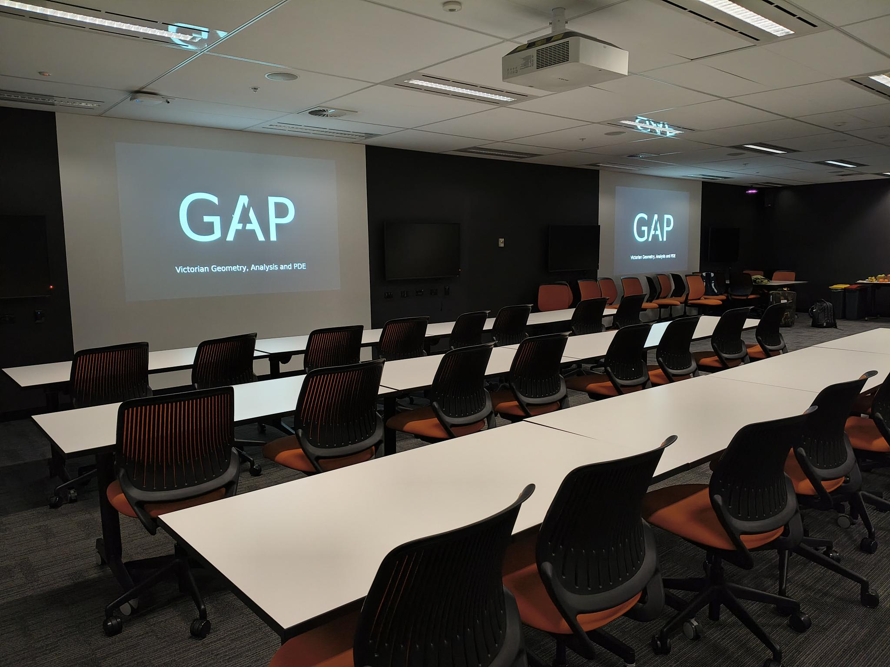
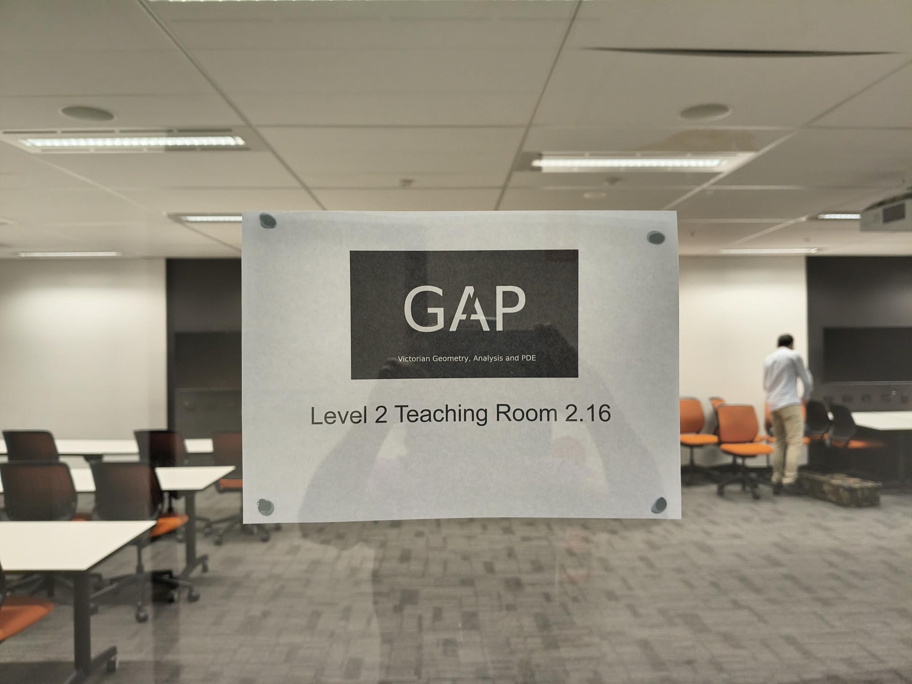
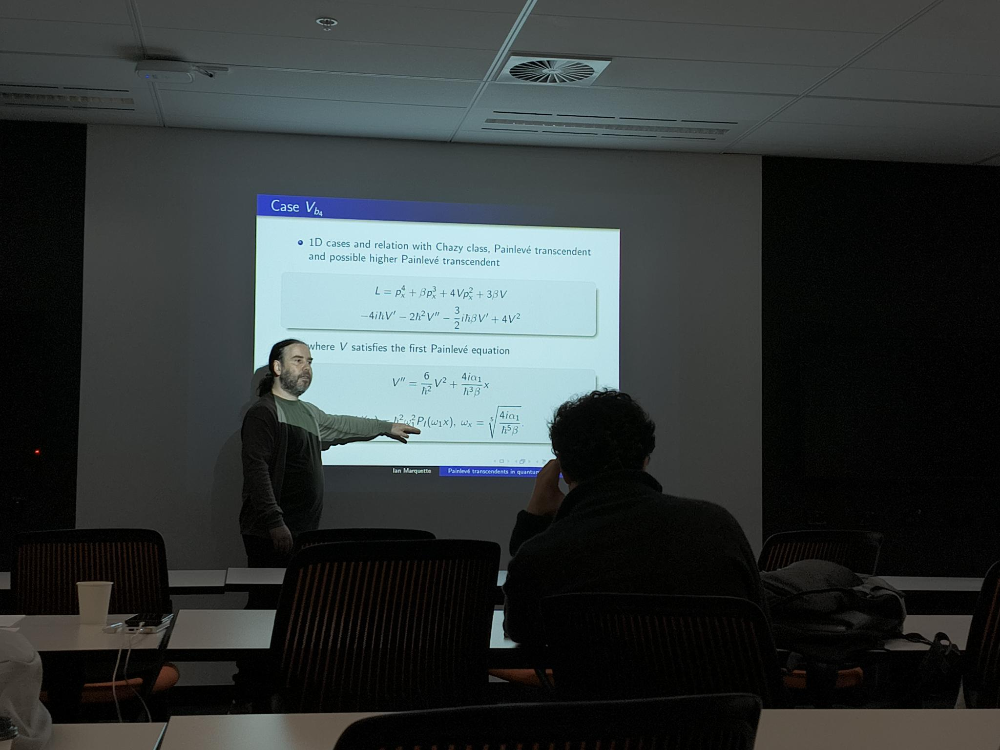
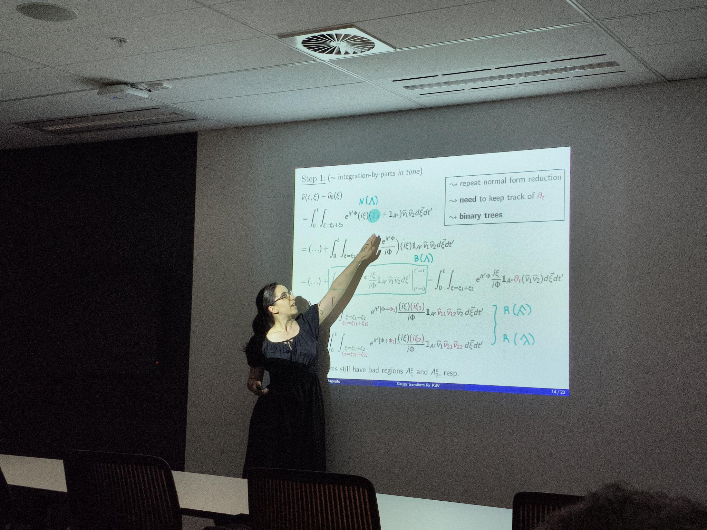
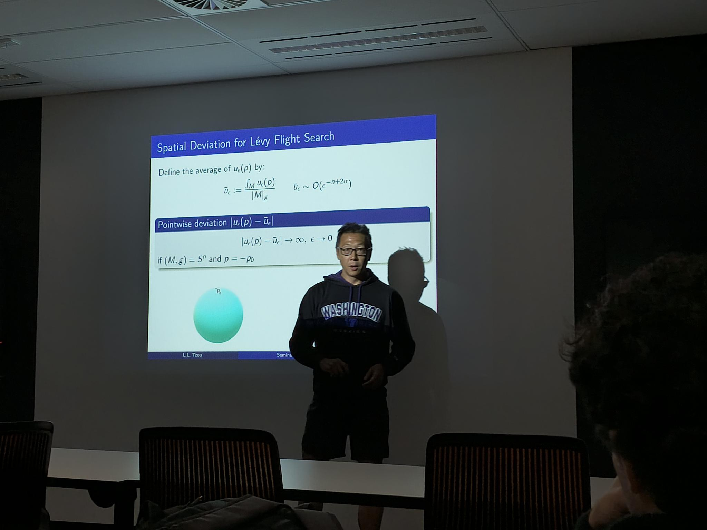
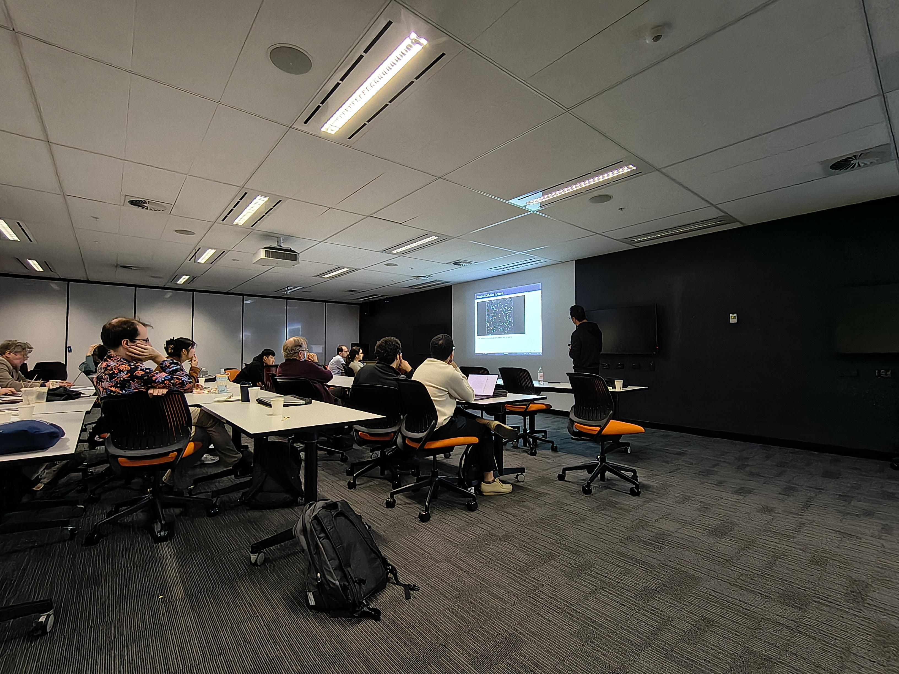
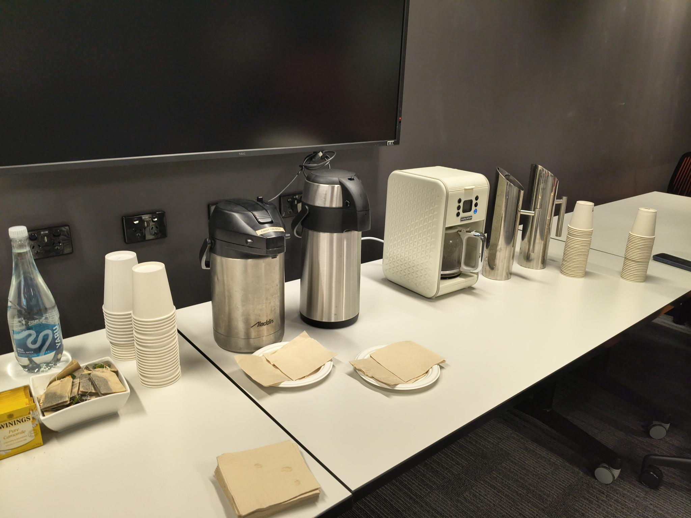
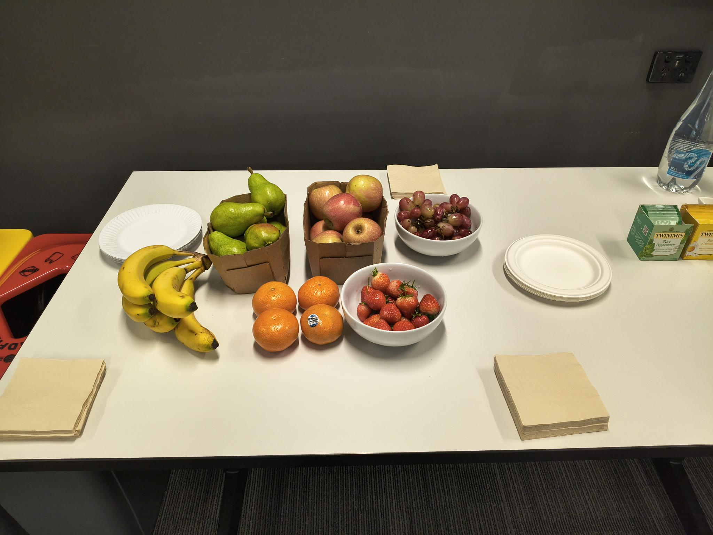

The second meeting and seminar of the Victorian GAP took place on the 22nd April 2026.

<!--more-->

The speakers were [Andreia Chapouto](https://achapouto.pages.math.cnrs.fr/chapouto/) (Monash University), [Ian Marquette](https://scholars.latrobe.edu.au/imarquette) (La Trobe University), and [Leo Tzou](https://leotzouresearch.wordpress.com/) (University of Melbourne).

There were about 20 participants in total. 

Thanks to Deakin University for their support for tea and coffee, La Trobe University for the excellent venue, the speakers and also the participants.

Moving into the future, we hope to have 3 to 4 meetings a year.

Those in Victoria working on topics related to geometry, analysis and PDE and would like to become members and to be included in: https://vicgap.org/members/, please [email](mailto:geometry.analysis.pde@gmail.com) us with the following: 

  -  editing out the [MYNAME.md](/uploads/MYNAME.md) file attached in the fields
  - a headshot image of about 400x400 pixels (optional, although highly recommended!).

Here are some images from the day.

        
